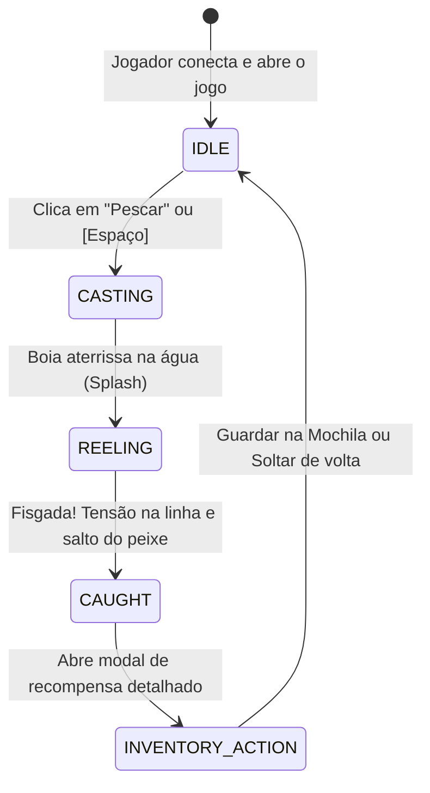

# 🎣 Pescaria 2D - Jogo de Pesca no Navegador

Jogo de pesca 2D completo e interativo executado diretamente no navegador com física de água e linha em HTML5 Canvas, efeitos sonoros sintetizados em tempo real via Web Audio API, sistema de raridade calibrado e negociações (trading) peer-to-peer em tempo real com WebSockets (Socket.io) e persistência transacional em SQLite.

---

## 🚀 Como Executar o Projeto

### Pré-requisitos
- Node.js (v18+)
- npm

### 1. Instalação das Dependências
```bash
npm install
```

### 2. Executar em Modo de Desenvolvimento
```bash
npm run dev
```
Abra o navegador em: [http://localhost:3000](http://localhost:3000)

*(O servidor Express inicializa o Vite em modo middleware, fornecendo recarregamento rápido, compilação de TypeScript em tempo real, APIs REST e WebSockets na mesma porta 3000).*

### 3. Rodar a Suíte de Testes Unitários
```bash
npm test
```
Executa a validação matemática das probabilidades (100.000 amostras), limites de peso por espécie, determinismo com sementes PRNG e validações transacionais da mochila.

### 4. Build para Produção
```bash
npm run build
npm start
```

---

## 🌊 1. Loop de Gameplay e Mecânicas



1. **Identificação Simples**: O jogador entra fornecendo apenas Nome e E-mail.
2. **Cenário 2D Canvas**: Céu animado com nuvens, sol e montanhas; água multicamadas com ondas senoidais; trapiche com pescador; vara e linha com física de flexão Bézier e boia flutuante.
3. **Mesa de Recompensa**: Exibe o espécime fisgado com sprite vetorial detalhado, raridade (Nível 1 a 6), peso calculado dinamicamente e história da espécie.
4. **Mochila e Limite**: Capacidade máxima inicial de 20 peixes. O jogador pode inspecionar detalhes, soltar peixes para abrir espaço ou ofertá-los no mercado de trocas.

---

## 🐟 2. Tabela de Raridades, Probabilidades e Pesos

| Nível de Raridade | Probabilidade (%) | Espécies de Exemplo | Faixa de Peso Típica |
| :--- | :---: | :--- | :--- |
| **Nível 1 (Muito Comum)** | **40%** | Lambari, Piaba, Acará | 50g a 250g |
| **Nível 2 (Comum)** | **25%** | Tilápia, Pacu pequeno | 300g a 1.2kg |
| **Nível 3 (Incomum)** | **18%** | Carpa-espelho, Bagre | 1.5kg a 5.0kg |
| **Nível 4 (Raro)** | **10%** | Truta Arco-Íris, Black Bass | 2.0kg a 7.0kg |
| **Nível 5 (Épico)** | **5%** | Dourado, Tucunaré-Açu | 6.0kg a 16.0kg |
| **Nível 6 (Lendário)** | **2%** | Pirarucu Gigante, Jaú | 25.0kg a 120.0kg |

*Cálculo do Peso:* Cada espécie possui `minWeight` e `maxWeight`. O peso é sorteado usando uma distribuição de probabilidade triangular com amostragem dual que favorece a média ecológica com leve bônus de raridade para exemplares troféu.

---

## 🤝 3. Sistema de Trocas (Trading) em Tempo Real

- **Descoberta de Jogadores**: Lista em tempo real de outros pescadores online e campo para convidar via e-mail direto.
- **Sala de Troca de Duas Vias**:
  - Jogador A oferta de 1 a 3 peixes da sua mochila.
  - Jogador B oferta de 1 a 3 peixes da sua mochila.
  - Qualquer alteração na oferta reseta automaticamente as confirmações (anti-golpe de troca).
- **Validação Transacional de Segurança**:
  - Confirmação de posse de todos os itens oferecidos.
  - Validação de que nenhum jogador ultrapassará o limite de 20 slots pós-troca.
  - Transferência atômica via `db.transaction()` no SQLite com registro em log de auditoria.

---

## 📂 Arquitetura do Código

```
pescaria/
├── src/
│   ├── shared/
│   │   ├── types.ts           # Interfaces de Jogador, Peixe, Instância, Troca e Estados
│   │   ├── fishData.ts        # Catálogo de espécies, pesos min/max e paletas de cores
│   │   └── fishingEngine.ts   # Algoritmos determinísticos, PRNG Mulberry32 e validações
│   ├── server/
│   │   ├── db.ts              # SQLite (users, inventory, trade_history, transações)
│   │   ├── tradeManager.ts    # Gerenciador de sessões e eventos Socket.io de troca
│   │   └── index.ts           # Express REST API + Servidor HTTP + Vite Middleware
│   └── client/
│       ├── index.html         # Estrutura do jogo, canvas e modais acessíveis
│       ├── style.css          # Estilo moderno náutico arcade e responsivo
│       ├── audio.ts           # Efeitos sonoros procedurais com Web Audio API
│       ├── gameCanvas.ts      # Renderizador 2D Canvas (ondas, pescador, boia, partículas)
│       ├── fishRenderer.ts    # Gerador vetorial SVG de peixes
│       ├── stateMachine.ts    # Máquina de estados finita da pescaria
│       └── app.ts             # Controlador cliente conectando UI, REST e WebSockets
├── test/
│   └── fishing.test.ts        # Testes de distribuição estatística e regras de negócio
├── package.json
├── tsconfig.json
└── vite.config.ts
```
