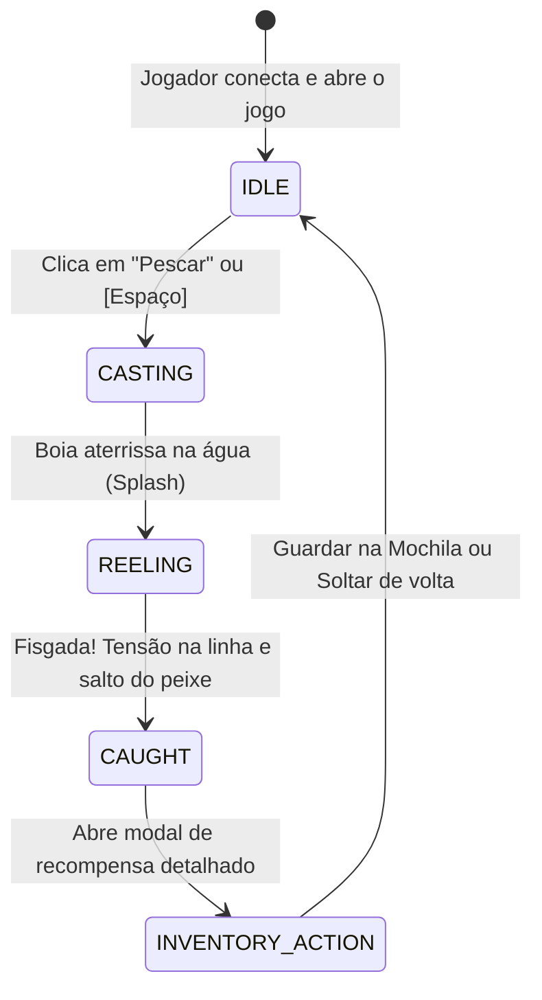

# 🎣 Pescaria 2D - Jogo de Pesca no Navegador

Jogo de pesca 2D completo e interativo executado diretamente no navegador com física de água e linha em HTML5 Canvas, efeitos sonoros sintetizados em tempo real via Web Audio API, sistema de raridade calibrado e negociações (trading) peer-to-peer em tempo real com WebSockets (Socket.io) e persistência transacional em SQLite.

---

## 🚀 Como Executar o Projeto

### Pré-requisitos
- Node.js (v18+)
- npm

### 1. Instalação das Dependências
```bash
npm install
```

### 2. Executar em Modo de Desenvolvimento
```bash
npm run dev
```
Abra o navegador em: [http://localhost:3000](http://localhost:3000)

*(O servidor Express inicializa o Vite em modo middleware, fornecendo recarregamento rápido, compilação de TypeScript em tempo real, APIs REST e WebSockets na mesma porta 3000).*

### 3. Rodar a Suíte de Testes Unitários
```bash
npm test
```
Executa a validação matemática das probabilidades (100.000 amostras), limites de peso por espécie, determinismo com sementes PRNG e validações transacionais da mochila.

### 4. Build para Produção
```bash
npm run build
npm start
```

---

## 🌊 1. Loop de Gameplay e Mecânicas



1. **Identificação Simples**: O jogador entra fornecendo apenas Nome e E-mail.
2. **Cenário 2D Canvas**: Céu animado com nuvens, sol e montanhas; água multicamadas com ondas senoidais; trapiche com pescador; vara e linha com física de flexão Bézier e boia flutuante.
3. **Mesa de Recompensa**: Exibe o espécime fisgado com sprite vetorial detalhado, raridade (Nível 1 a 6), peso calculado dinamicamente e história da espécie.
4. **Mochila e Limite**: Capacidade máxima inicial de 20 peixes. O jogador pode inspecionar detalhes, soltar peixes para abrir espaço ou ofertá-los no mercado de trocas.

---

## 🐟 2. Tabela de Raridades, Probabilidades e Pesos

| Nível de Raridade | Probabilidade (%) | Espécies de Exemplo | Faixa de Peso Típica |
| :--- | :---: | :--- | :--- |
| **Nível 1 (Muito Comum)** | **40%** | Lambari, Piaba, Acará | 50g a 250g |
| **Nível 2 (Comum)** | **25%** | Tilápia, Pacu pequeno | 300g a 1.2kg |
| **Nível 3 (Incomum)** | **18%** | Carpa-espelho, Bagre | 1.5kg a 5.0kg |
| **Nível 4 (Raro)** | **10%** | Truta Arco-Íris, Black Bass | 2.0kg a 7.0kg |
| **Nível 5 (Épico)** | **5%** | Dourado, Tucunaré-Açu | 6.0kg a 16.0kg |
| **Nível 6 (Lendário)** | **2%** | Pirarucu Gigante, Jaú | 25.0kg a 120.0kg |

*Cálculo do Peso:* Cada espécie possui `minWeight` e `maxWeight`. O peso é sorteado usando uma distribuição de probabilidade triangular com amostragem dual que favorece a média ecológica com leve bônus de raridade para exemplares troféu.

---

## 🤝 3. Sistema de Trocas (Trading) em Tempo Real

- **Descoberta de Jogadores**: Lista em tempo real de outros pescadores online e campo para convidar via e-mail direto.
- **Sala de Troca de Duas Vias**:
  - Jogador A oferta de 1 a 3 peixes da sua mochila.
  - Jogador B oferta de 1 a 3 peixes da sua mochila.
  - Qualquer alteração na oferta reseta automaticamente as confirmações (anti-golpe de troca).
- **Validação Transacional de Segurança**:
  - Confirmação de posse de todos os itens oferecidos.
  - Validação de que nenhum jogador ultrapassará o limite de 20 slots pós-troca.
  - Transferência atômica via `db.transaction()` no SQLite com registro em log de auditoria.

---

## 📱 4. Compartilhamento Fácil no WhatsApp

Tanto na tela de recompensa ao fisgar quanto ao inspecionar a mochila, o jogador conta com um botão oficial do **WhatsApp** e um botão de **Copiar Texto**:
- **Compartilhamento 1-clique**: aciona a `Web Share API` nativa em smartphones ou abre diretamente `https://api.whatsapp.com/send?text=...` no desktop.
- **Detecção de Conquistas**: destaca automaticamente se a espécie é uma `🆕 NOVA DESCOBERTA NO ÁLBUM!` ou um `🏆 Novo recorde pessoal!`.
- **Contexto em Tempo Real**: indica localização, clima dinâmico, período do dia, capturas diárias e sequência de dias (*streak*).

```text
🐟 Tilápia
🎖️ Comum — ★★☆☆☆☆
⚖️ 1.15 kg
🫧 Tamanho: Grande
🆔 X0OGD9CNI6
🆕 NOVA DESCOBERTA NO ÁLBUM!
🏆 Novo recorde pessoal desta espécie!

📍 Lago Cristalino 🏝️ | ☀️ Ensolarado
🌅 Período: Manhã
🎣 Hoje: 6 fisgado(s)
📦 Mochila: 6/20
📗 Espécies no Álbum: 5/12
🔥 Streak: 4 dia(s) — nível Prata 🥈
🎯 Missão: completa ✅

🎣 Venha pescar comigo no Pescaria 2D!
https://pescaria2d.app
```

---

## ⚡ 5. Persistência e Deploy na Vercel

O projeto roda na infraestrutura da **Vercel** com persistência real de dados:

1. **Banco de Dados (Turso / libSQL)**:
   - O mesmo driver (`@libsql/client`) atende os dois ambientes, então não há divergência entre dev e produção:
     - **Desenvolvimento**: arquivo SQLite local em `./data/pescaria.db` (zero configuração).
     - **Produção**: banco remoto Turso via `TURSO_DATABASE_URL` + `TURSO_AUTH_TOKEN`.
   - ⚠️ **Sem essas variáveis na Vercel**, o banco cai no `/tmp` do Lambda, que é *apagado a cada cold start* — álbum, streak, recordes e mochila se perdem. O servidor emite um aviso no log quando isso acontece.
   - As trocas usam transação interativa (`client.transaction('write')`): a transferência de itens é atômica nos dois ambientes.

   ```bash
   npm i -g turso
   turso auth login
   turso db create pescaria
   turso db show pescaria --url      # -> TURSO_DATABASE_URL
   turso db tokens create pescaria   # -> TURSO_AUTH_TOKEN
   ```

   Copie `.env.example` para `.env` (local) e cadastre as duas variáveis no painel da Vercel (produção).

2. **Configuração Pronta (`vercel.json`)**:
   - `buildCommand`: `npm run build` (gera a pasta estática `dist/` servida na CDN global da Vercel).
   - `rewrites`: direciona chamadas `/api/(.*)` para a Serverless Function em [`api/index.ts`](file:///Users/thiagochagas/Documents/Projects/pescaria/api/index.ts).

3. **Modo Duplo de Negociações (Dual-Mode Trading)**:
   - Em ambiente local ou servidor Node dedicado: utiliza **WebSockets (Socket.io)** de baixa latência.
   - Na Vercel (onde conexões WebSocket persistentes não são suportadas em Serverless): o cliente ativa automaticamente o **Fallback REST Polling**, mantendo a troca peer-to-peer e lista de jogadores ativos 100% funcionais sem custos adicionais de servidores externos!

4. **Assets em WebP**:
   - Cenário e pescador são servidos em WebP (**95 KB** somados, contra 3,6 MB dos PNGs originais). Os arquivos-fonte ficam em `assets-src/`, fora do deploy.

5. **Deploy em 1 Clique**:
   ```bash
   npx vercel
   ```

---

## 🛡️ 6. Integridade da Economia

Como o valor de uma troca depende da raridade ser difícil de obter, a pescaria é limitada no **servidor**:

- `POST /api/fish/catch` aplica um cooldown de **3 segundos por jogador**, gravado em `users.last_catch_at`.
- A checagem é um `UPDATE` condicional (`WHERE last_catch_at <= ?`), atômico: requisições simultâneas não passam juntas.
- Excedendo o limite, a API responde **429** com `retryAfterMs`. A animação normal do jogo leva ~3,6s, então quem joga pela interface nunca esbarra nisso — só scripts em loop.

---

## 📗 7. Progresso, Streak e Álbum

Dados que antes só existiam no texto de compartilhamento agora aparecem na interface:

- **Indicadores no cabeçalho**: `🔥 dias seguidos`, `📗 espécies descobertas/total`, `🎣 fisgados hoje` — atualizados a cada captura, com destaque animado quando algum avança.
- **Peixepédia como álbum**: espécies descobertas aparecem coloridas com o **recorde pessoal de peso** e o número de capturas; as demais ficam em **silhueta** com a faixa de peso esperada. A lacuna visível é o que dá motivo pra voltar.
- `GET /api/user/:id/progress` devolve streak, capturas do dia e os recordes por espécie.

---

## 📂 Arquitetura do Código

```
pescaria/
├── api/
│   └── index.ts               # Entrypoint oficial para Vercel Serverless Functions
├── src/
│   ├── shared/
│   │   ├── types.ts           # Interfaces de Jogador, Peixe, Instância, Troca e Estados
│   │   ├── fishData.ts        # Catálogo de espécies, pesos min/max e paletas de cores
│   │   └── fishingEngine.ts   # Algoritmos determinísticos, PRNG Mulberry32 e validações
│   ├── server/
│   │   ├── app.ts             # Express REST API + Rotas Serverless de Troca e Presença
│   │   ├── dbClient.ts        # Driver libSQL/Turso, schema, migrações e transações
│   │   ├── db.ts              # Consultas: usuários, inventário, recordes, streak e cooldown
│   │   ├── tradeManager.ts    # Gerenciador de sessões e eventos Socket.io de troca
│   │   └── index.ts           # Servidor local Express + HTTP + Socket.io + Vite Middleware
│   └── client/
│       ├── index.html         # Estrutura do jogo, canvas e modais acessíveis
│       ├── style.css          # Estilo moderno náutico arcade e responsivo
│       ├── audio.ts           # Efeitos sonoros procedurais com Web Audio API
│       ├── gameCanvas.ts      # Motor 2D Canvas (ondas, pescador, boia, partículas)
│       ├── fishRenderer.ts    # Gerador vetorial SVG de peixes (com modo silhueta)
│       ├── stateMachine.ts    # Máquina de estados finita da pescaria
│       └── app.ts             # Controlador cliente com WebSocket e Fallback Polling
├── test/
│   └── fishing.test.ts        # Testes de distribuição estatística e regras de negócio
├── package.json
├── tsconfig.json
├── assets-src/                # PNGs originais dos assets (fora do deploy)
├── public/assets/             # Assets servidos em WebP
├── .env.example               # TURSO_DATABASE_URL e TURSO_AUTH_TOKEN
├── vercel.json                # Configuração de build e rotas da Vercel
├── .vercelignore              # Otimização de arquivos enviados no deploy
└── vite.config.ts
```
